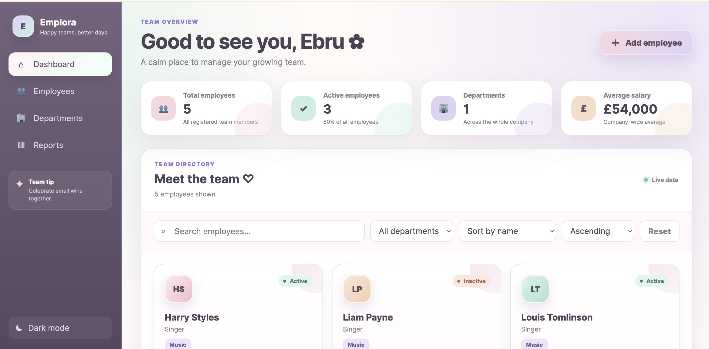
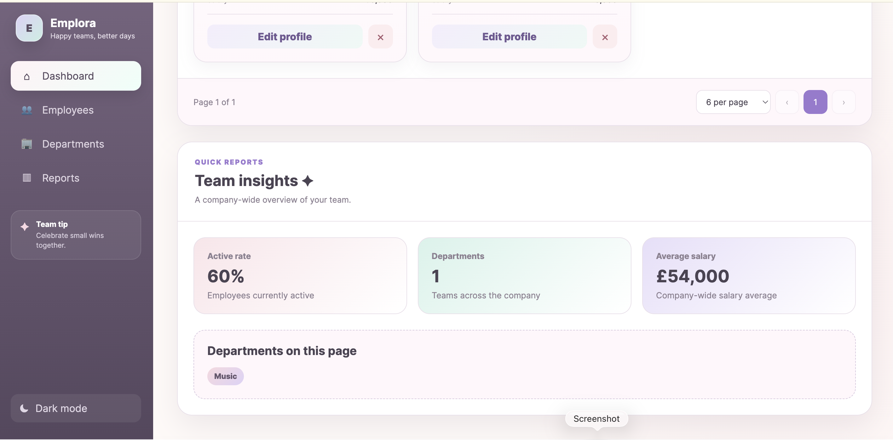

# 🌸 Emplora – Employee Management Dashboard

A modern full-stack employee management dashboard built with **Angular**, **ASP.NET Core Web API**, **Entity Framework Core**, and **Azure SQL Database**.

🔗 **Live Demo:** https://employee-management-dashboard-iota.vercel.app

---

## 📸 Preview

### Dashboard Overview



### Reports & Team Insights



---

## ✨ Features

- 👥 Employee management (Create, Read, Update, Delete)
- 🔍 Search employees instantly
- 🏢 Filter by department
- ↕️ Sort employees
- 📊 Live company statistics
- 📱 Responsive design
- ☁️ Cloud deployment
- 🎨 Modern pastel dashboard UI
- ⚡ RESTful API architecture

---

## 🛠️ Tech Stack

### Frontend

- Angular
- TypeScript
- HTML5
- CSS3

### Backend

- ASP.NET Core Web API
- Entity Framework Core
- SQL Server
- Azure SQL Database

### Cloud & Deployment

- Azure App Service
- Azure SQL Database
- Vercel

### Version Control

- Git
- GitHub

---

## 📁 Project Structure

```text
employee-management-dashboard
│
├── backend/
│   └── EmployeeManagement.Api
│
├── frontend/
│
├── images/
│   ├── dashboard-overview.png
│   └── reports-section.png
│
├── LICENSE
└── README.md
```

---

## 🏗️ Architecture

```text
Angular Frontend
        │
        ▼
ASP.NET Core Web API
        │
        ▼
Employee Service Layer
        │
        ▼
Entity Framework Core
        │
        ▼
Azure SQL Database
```

---

## 🚀 Getting Started

### Clone the repository

```bash
git clone https://github.com/ebruakdemir/employee-management-dashboard.git
```

### Backend

```bash
cd backend/EmployeeManagement.Api
dotnet restore
dotnet run
```

The API will start on:

```
http://localhost:5215
```

---

### Frontend

```bash
cd frontend
npm install
ng serve
```

Open:

```
http://localhost:4200
```

---

## 📦 Deployment

### Frontend

- Vercel

### Backend

- Azure App Service

### Database

- Azure SQL Database

---

## 📈 Current Features

- Employee CRUD operations
- Company statistics
- Employee search
- Department filter
- Sorting
- Pagination
- Responsive dashboard
- Loading states
- Empty state
- Modern UI

---

## 🔮 Future Improvements

- JWT Authentication
- User login system
- Employee profile page
- Charts and analytics
- Export to Excel / CSV
- Dark mode
- Unit testing
- Docker support
- GitHub Actions CI/CD

---

## 👩‍💻 Author

**Ebru Akdemir**

GitHub:
https://github.com/ebruakdemir

---

## 📄 License

This project is licensed under the MIT License.